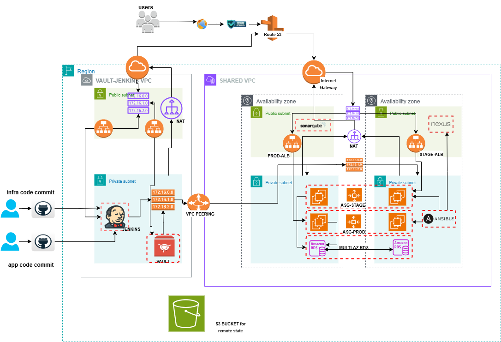

# Automated Multi-Phase Infrastructure with Terraform, Jenkins, and Vault on AWS

This project demonstrates an end-to-end Infrastructure as Code workflow on AWS. 
It provisions a secure Terraform backend (S3), uploads Ansible playbooks, and deploys Jenkins 
and Vault infrastructure. Subsequent phases use a Jenkins pipeline to manage Terraform deployments, 
Vault setup, and module rollouts.

## Architecture Diagram  

## Project Phases
- **Phase 1**: Environment setup script (S3 backend, Ansible upload, Jenkins/Vault VPC provisioning)  
- **Phase 2**: Jenkins CI/CD pipeline for Vault init and module deployments  
- **Phase 3**: Module deployments and teardown automation

##  Phase 1: Environment Setup Script

This script is the **initial setup phase** of the project. Its primary function is to prepare the **AWS environment** for subsequent Terraform deployments by creating a secure S3 backend for state locking, configuring the S3 bucket's policies, uploading initial Ansible code, and finally provisioning the foundational **Jenkins and Vault VPC infrastructure** using Terraform.

***

### Script Configuration and Prerequisites

#### Prerequisites

1.  **AWS CLI:** Must be installed and configured.
2.  **AWS Profile:** The profile defined by the `AWS_PROFILE` variable must exist locally and have permissions for S3, IAM, EC2, and other resources required by the Terraform configuration.
3.  **Local Ansible Project:** The directory specified by `LOCAL_ANSIBLE_PROJECT_DIR` (`./module/ansible/ansible-project`) must exist and contain the initial Ansible code.
4.  **Terraform Infrastructure Code:** The `jenkins-vault` directory must contain the Terraform code for provisioning the initial VPC, Jenkins, and Vault instances.

#### Variables

The script is configured via the following internal variables:

| Variable | Value | Purpose |
| :--- | :--- | :--- |
| `BUCKET_NAME` | `pet-bucket-new` | **Remote Backend:** The name of the S3 bucket for Terraform state and Ansible code storage. |
| `AWS_REGION` | `us-east-2` | **Region:** The AWS region where all resources will be created. |
| `AWS_PROFILE` | `ola-devops` | **Authentication:** The local AWS CLI profile used for credentials. |
| `INFRA_TERRAFORM_DIR` | `jenkins-vault` | The local directory containing the Phase 1 Terraform code. |
| `LOCAL_ANSIBLE_PROJECT_DIR` | `./module/ansible/ansible-project` | **Source:** Local path to the initial Ansible project folder. |
| `S3_ANSIBLE_PREFIX` | `ansible-code/latest/` | **Destination:** The S3 prefix (folder path) where Ansible code will be stored. |

***

### Script Execution Flow

The script follows a sequential, failure-safe execution model (`set -e`):

#### 1. S3 Backend Setup

This section ensures a secure and reliable remote backend for Terraform state management is in place.

| Step | Action | Description |
| :--- | :--- | :--- |
| **Check & Create Bucket** | `aws s3api head-bucket` / `create-bucket` | Checks for the existence of **`pet-bucket-new`**. If it doesn't exist, it creates it in `us-east-2`, correctly setting the `LocationConstraint`. |
| **Enable Versioning** | `aws s3api put-bucket-versioning` | Enables **S3 Versioning** on the bucket. This is critical for protecting the Terraform state file against accidental deletion or corruption. |
| **Enable Encryption** | `aws s3api put-bucket-encryption` | Enforces **AES256 Server-Side Encryption (SSE-S3)** as the default encryption for all objects uploaded to the bucket, ensuring data at rest is secure. |

#### 2. Initial Ansible Code Upload

The latest Ansible project code is synced to the S3 bucket, making it available for the deployed instances (Jenkins, Vault, etc.) to fetch and execute.

| Step | Action | Description |
| :--- | :--- | :--- |
| **Directory Check** | `if [ ! -d ... ]` | Performs a critical check to ensure the local source directory for Ansible exists before attempting the sync. |
| **S3 Sync** | `aws s3 sync` | Recursively copies the contents of **`./module/ansible/ansible-project`** to the S3 path **`s3://pet-bucket-new/ansible-code/latest/`**. |

#### 3. Terraform Infrastructure Deployment

This is the final step, which deploys the base environment where the subsequent phases will run.

| Step | Action | Location |
| :--- | :--- | :--- |
| **Change Directory** | `cd "$INFRA_TERRAFORM_DIR"` | Moves into the **`jenkins-vault`** directory containing the infrastructure code. |
| **Terraform Init** | `terraform init` | Initializes the working directory, downloading providers and configuring the remote backend (S3 bucket created in step 1). |
| **Terraform Apply** | `terraform apply -auto-approve` | Provisions the core infrastructure, which includes the separate VPCs for **Jenkins** and **Vault**. The `-auto-approve` flag prevents a manual confirmation prompt. |
| **Error Handling** | `if ! terraform apply...` | Includes an explicit check to stop the script and notify the user if the infrastructure deployment fails. |

## Phase 2 execution using jenkins

This phase describes the continuous integration and continuous deployment (CI/CD) pipeline for provisioning and managing the remaining infrastructure using **Terraform**. The pipeline supports both **deployment** (`apply`) and **teardown** (`destroy`) of the infrastructure in a controlled, multi-phase manner, however, before you execute this phase make sure to read the [vault setup](./vault_setup.md), it will guide you on the manual setup of the vault.

***

### Pipeline Overview

| Feature | Description |
| :--- | :--- |
| **Type** | Declarative Jenkins Pipeline |
| **Tooling** | **Terraform** (for IaC), **Git** (for SCM) |
| **Target Infrastructure** | Vault server setup and configuration, along with module deployments (likely on AWS, given the credentials). |
| **Execution Path** | Controlled by the user-selected `action` parameter (`apply` or `destroy`). |
| **Notifications** | Sends job status to a dedicated **Slack** channel. |

***

### Pipeline Configuration & Prerequisites

#### Agent and Tools

The pipeline is configured to run on **any available agent** and requires the following tool to be pre-configured in Jenkins:

* **Terraform:** Must be available on the execution agent and aliased as `'terraform'`.

#### User Parameters

The pipeline must be triggered manually, requiring the user to select one of the following actions:

| Parameter Name | Choices | Description |
| :--- | :--- | :--- |
| **`action`** | `apply`, `destroy` | Selects whether to provision the infrastructure (`apply`) or tear it down (`destroy`). |

#### Environment Variables

The following variables are configured globally for the pipeline:

| Variable | Value | Description |
| :--- | :--- | :--- |
| `SLACKCHANNEL` | `vaultops` | The Slack channel for pipeline notifications. |
| `DOMAIN_NAME` | `alasoasiko.co.uk` | The base domain name used for resource configuration. |
| `VAULT_ADDRESS` | `https://vault.alasoasiko.co.uk` | The address for the HashiCorp Vault server. |

#### Credentials Used

Multiple Jenkins **Secret Text** credentials and one **AWS Credentials** credential are required to execute the pipeline securely. Credentials are automatically injected as environment variables within their respective stages.

| Credentials ID | Usage |
| :--- | :--- |
| `github-cred` | Used for checking out the source code from the Git repository. |
| `aws-cred` | Used for authenticating with **AWS** in the module deployment stage. |
| `vault_token` | Token for authenticating to the **Vault** server. |
|  `db_static_username`, `db_static_password` | master username and password for the database |
| `newrelic_api_key`, `newrelic_user_id`| newrelic credentials, id and api-key|
| `sonarqube_db_username`, `sonarqube_db_password` | Sonarqube credentials | 
| `vault_server_private_ip` | Private IP of the Vault server. |

***

### Pipeline Stages

The pipeline defines distinct stages for applying and destroying infrastructure, ensuring a proper, dependency-aware execution order.

#### 1. Checkout

**Action:** Clones the project repository.
**Details:** Checks out the `*/main` branch from `https://github.com/your-org/your-repo.git` using the `github-cred` Jenkins credential.

#### 2. Phase 2 - Vault Init Config Apply (Conditional: `action == 'apply'`)

**Action:** Applies the initial Vault configuration.
**Location:** Executes Terraform commands in the **`vault-initial-config`** directory.

#### 3. Phase 3 - Module Deployment (Conditional: `action == 'apply'`)

**Action:** Deploys subsequent infrastructure modules, dependent on Phase 2 outputs.
**Location:** Executes Terraform commands in the **`module`** directory.

#### 4. Destroy - Phase 3 Modules (Conditional: `action == 'destroy'`)

**Action:** **Teardown** of the Phase 3 (Module Deployment) infrastructure.
**Details:** Executes the same credential and output retrieval steps as the `apply` path, but runs `terraform destroy` in the **`module`** directory, ensuring dependent resources are removed first.

#### 5. Destroy - Phase 2 - Vault Init Config Infrastructure (Conditional: `action == 'destroy'`)

**Action:** **Teardown** of the Phase 2 (Initial Vault Config) infrastructure.
**Details:** Executes the same credential binding steps as the `apply` path, but runs `terraform destroy` in the **`vault-initial-config`** directory, which must be executed *after* Phase 3 is destroyed.

***

### Post-Build Actions (Notifications)

Upon completion, the pipeline sends a notification to the configured **`vaultops`** Slack channel:

* **Success:** Sends a 'good' (green) colored message with the job name, build number, and link.
* **Failure:** Sends a 'danger' (red) colored message with the job name, build number, and link.